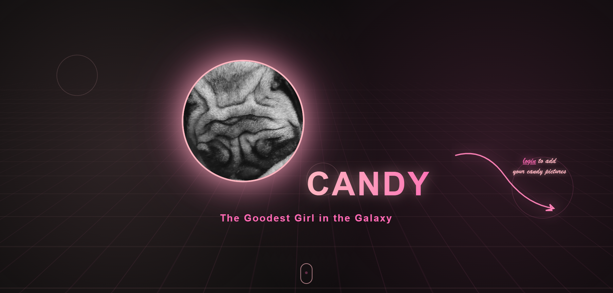
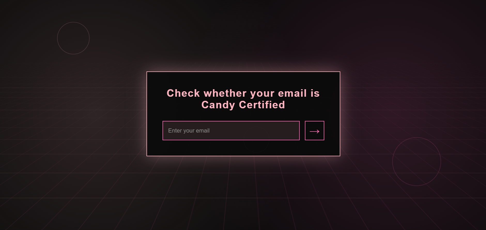
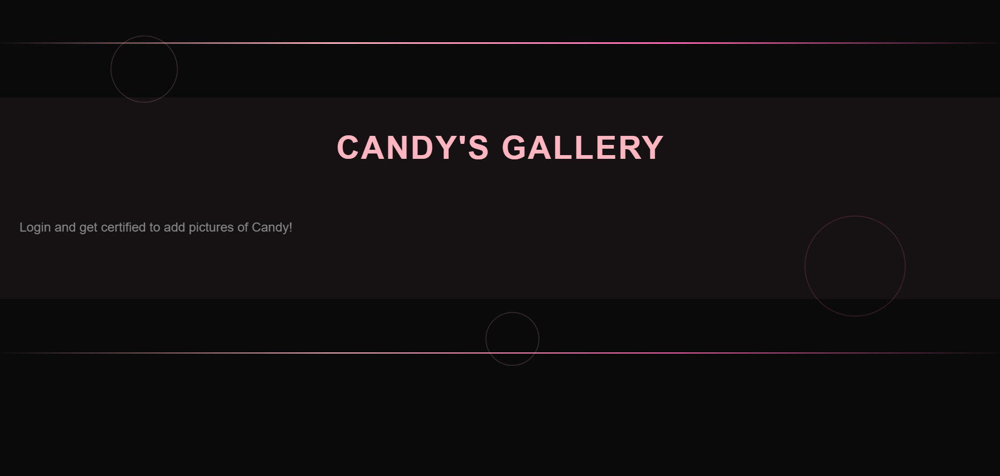
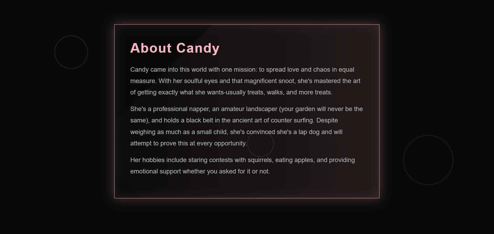
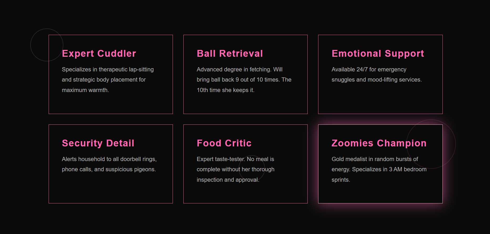
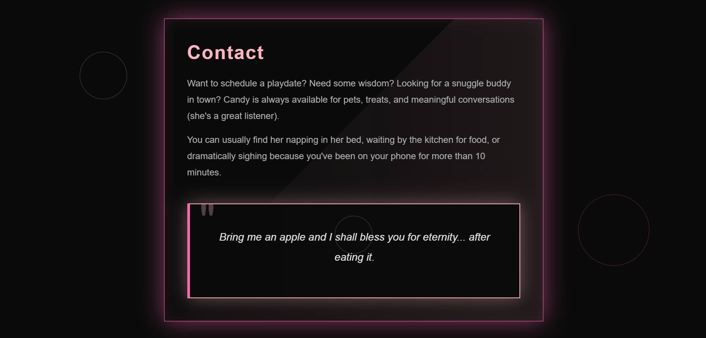

# 🐕 Candy's Digital Portfolio

> *"Bring me an apple and I shall bless you for eternity... after eating it."*

A modern, cyberpunk-inspired portfolio website for Candy - developed as part of my project for Web Technologies.

<div align="center">

[](https://your-github-pages-url.com)
[](https://github.com/YOUR-USERNAME/candy-website)
[](https://github.com/YOUR-USERNAME/candy-website)

</div>


## 🌟 What is This?

**Candy's Digital Portfolio** is a personal website built as my semester's project for Web Technologies showcasing the extraordinary life, skills, and adventures of Candy - my dog.

This isn't just another pet website. It's a living, breathing gallery where:

- **Friends and family** can upload pictures they've clicked with or of Candy
- **The world** can witness the pure joy that is Candy's existence
- **Certified humans** get exclusive access to contribute to her ever-growing photo gallery

## 💡 Why Does This Exist?

### The Origin Story

This project is a drive towards increasing awareness and ensuring the well-being of entities that exist in our lives as nobodies but to them, we're everything.


### The Philosophy

In Candy's own words:
> "I don't understand conventional photo albums. They're slow, traceable, and require opposable thumbs. I prefer the digital realm - it's fast, it glows, and my humans can access it from anywhere."

## ✨ Features

### Current Features

#### 🎨 **Cyberpunk Aesthetic**
- Neon pink (#FFB6C1) and hot pink (#FF69B4) color scheme
- Smooth parallax scrolling effects
- Animated background grid
- Glitch effects on text
- Floating geometric shapes that respond to mouse movement


#### 🔐 **Secure Email Authentication**
- Admin-approved user system (because not everyone can handle Candy's cuteness)
- Email verification with admin approval workflow
- Candy HQ certification process (very official, much wow)
- Persistent user sessions


#### 🖼️ **Interactive Photo Gallery**
- Infinite scrolling gallery strip (like Candy's energy)
- Smooth animations that pause on hover (to properly admire each photo)
- Upload multiple images at once (for extensive photoshoots)
- Browser-stored images (persists until you clear your cache)


#### 🐾 **About Candy**
- Professional introduction (because she's a very professional girl)
- Detailed "About" section (covering her expertise in napping and counter surfing)
- Skills showcase (6 cards highlighting her core competencies)
- Contact section with wisdom quotes (for those seeking Candy's guidance)

## 🛠️ Tech Stack

### Frontend
- **HTML5** - Structure 
- **CSS3** - Cyberpunk styling with custom animations
- **Vanilla JavaScript** - Functionalities
- **LocalStorage** - Browser-based image persistence
- **SessionStorage** - Session management

### Backend
- **Node.js** - Runtime 
- **Express.js** - Web framework 
- **Nodemailer** - Email notifications 
- **JSON Files** - Data persistence


## 📸 Screenshots

### Homepage

*Candy's commanding presence greets visitors with neon glory*

### Login System

*Get certified by Candy HQ - an honor, really*

### Photo Gallery

*An infinite scroll of pure joy and chaos*

### About Section

*Candy's professional qualifications and expertise*

### Skills Showcase

*Six areas where Candy excels (and she's being modest)*

### Contact Candy

*Open to discussions*

---

## 🎯 Getting Started

### Prerequisites
- Node.js v14+ (Candy recommends the latest)
- npm (comes with Node.js)
- Gmail account (for email notifications)
- Love for dogs (mandatory)

### Installation

1. **Clone the repository**
```bash
git clone https://github.com/YOUR-USERNAME/candy-website.git
cd candy
```

2. **Install dependencies**
```bash
npm install
```

3. **Configure environment variables**
```bash
# Edit .env with your credentials
```

4. **Start the server**
```bash
npm start
```

5. **Visit the website**
```
http://localhost:3000
```

---


<div align="center">

### ⭐ Star this repo if Candy made you smile! ⭐

Made with 💖, 🍎, and countless belly rubs

**Candy Approved™**


</div>

